This is a responsive online blog web app. Build an Frontend NextJs or Backend nodejs(express).

This web app using dependencies are:
```bash
"axios": "^1.4.0",
"bootstrap": "^5.3.0",
"cors": "^2.8.5",
"express": "^4.18.2"
```

Application functionality are:
- Create, Update, Delete, View Blog
- Create, Update, Delete, View Comment
- Frontend using NextJs app Router
- Backend server using NodeJS(Express)
- Blog page like/unlike
- Blog post comment
- Loading indicator
- responsive large, laptop, tablet, mobile screen.

## Getting Started
Highly recommended use chrome browser.

1. First download the code and run:

Client side and Server side folder
```bash
npm install
```

2. Run the development server:

Client side
```bash
npm run dev
```
Server side
```bash
node index.js
```

Open [http://localhost:3000](http://localhost:3000) with your browser to see the result.

## MERN Blog App view
Add new Blog
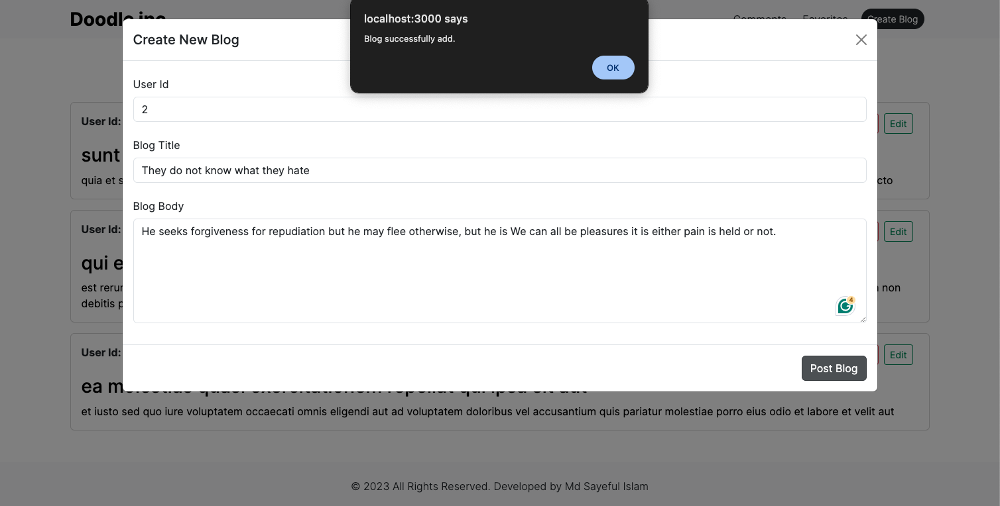

Blog Home page
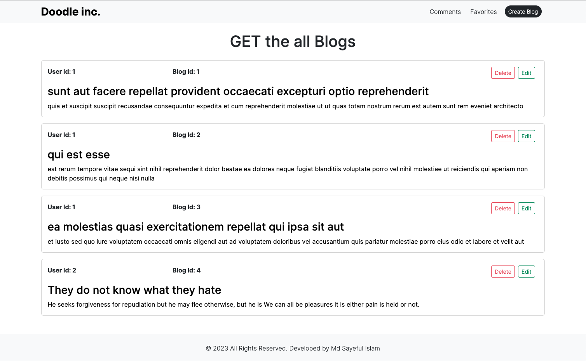

Blog page
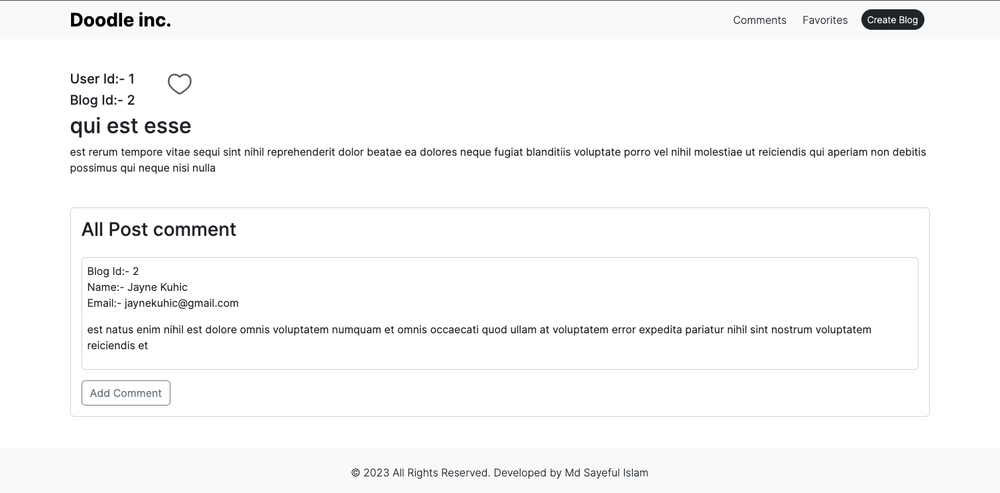

Delete Blog page
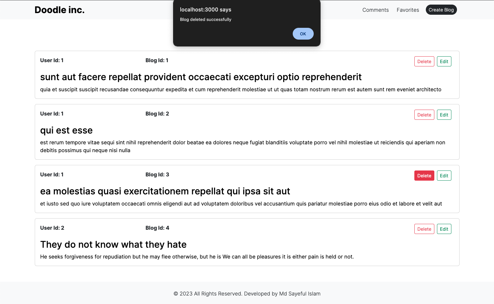

Update Blog page
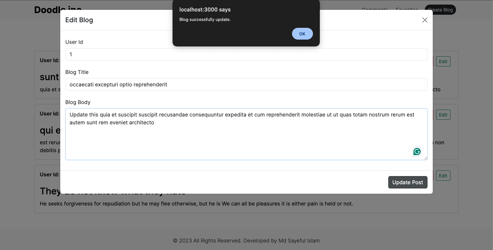

Like page
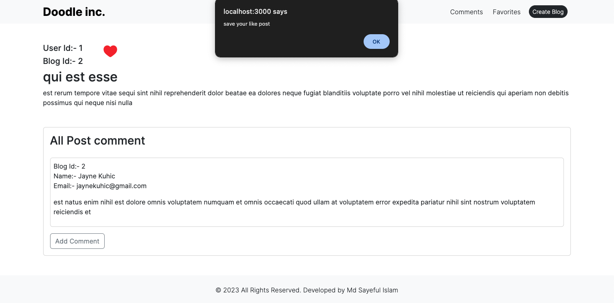

All Favorite List
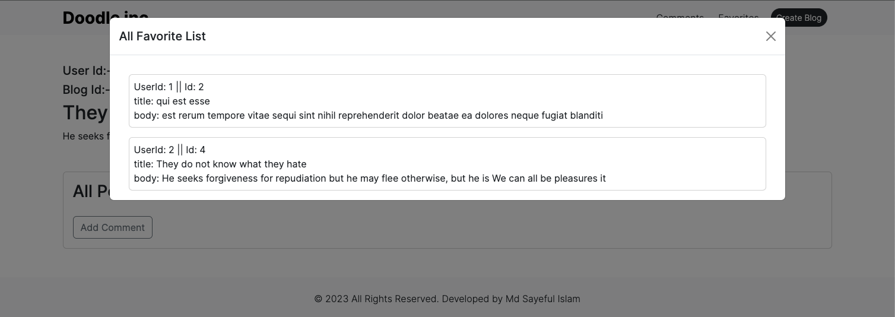

Add new Comment
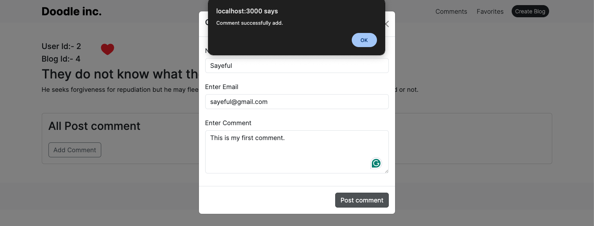

All Comment List
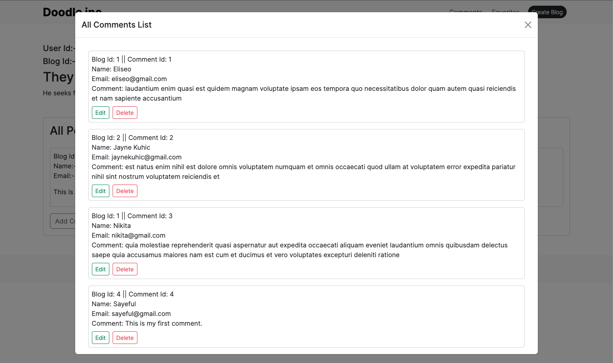

Update Comment
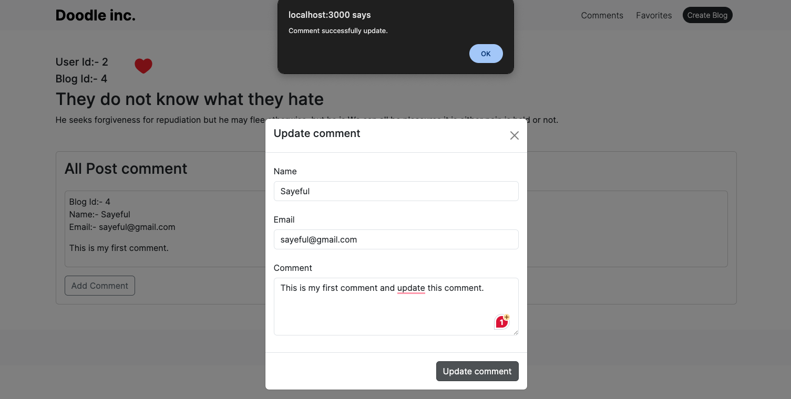

Delete Comment
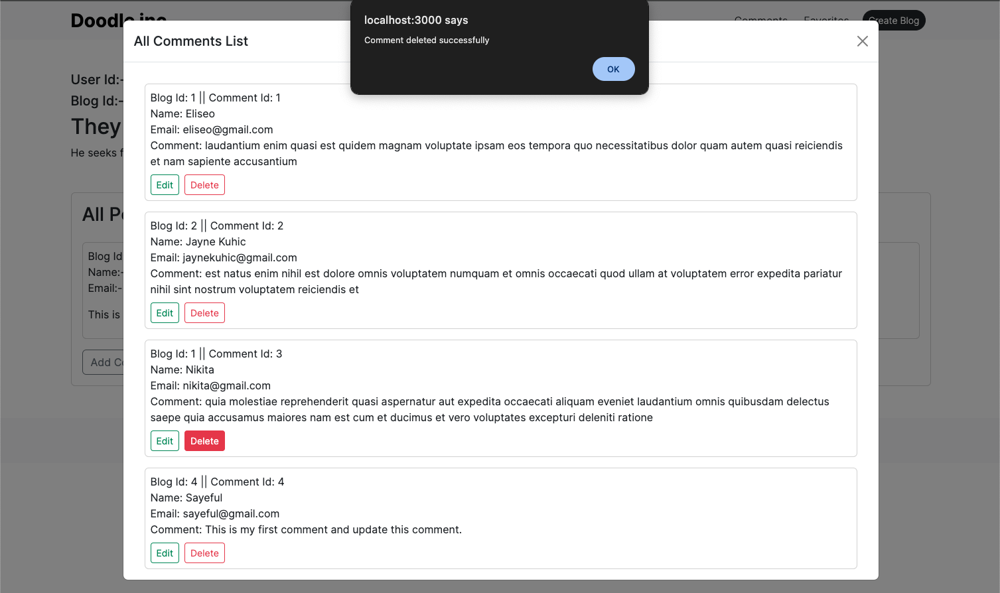

